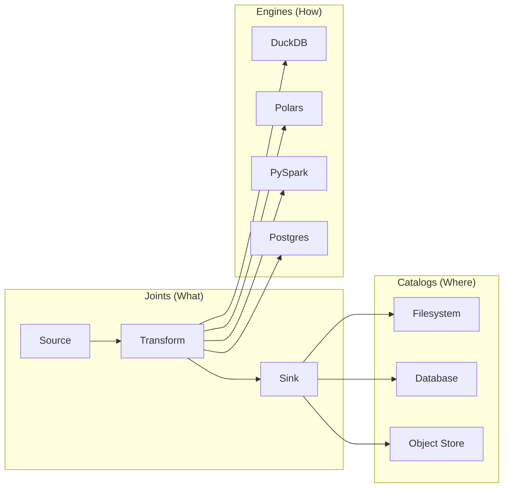

<!-- Logo / Banner -->
<p align="center">
  
</p>

<!-- Badges -->
<p align="center">
  <a href="https://pypi.org/project/rivetsql/"></a>
  <a href="https://pypi.org/project/rivetsql/"></a>
  <a href="https://github.com/rivetsql/rivet/blob/main/LICENSE"></a>
  <a href="https://github.com/rivetsql/rivet/actions/workflows/ci.yml"></a>
</p>

<p align="center"><strong>Declarative SQL pipelines — define what, not how.</strong></p>

---

Rivet separates *what* to compute (joints) from *how* to compute (engines) and *where* data lives (catalogs). Define your pipeline once — run it on DuckDB, Polars, PySpark, or Postgres without changing your logic.

## Features

- **Multi-engine execution** — swap between DuckDB, Polars, PySpark, and Postgres without rewriting pipelines
- **Declarative pipelines** — define joints in SQL, YAML, or Python
- **Quality checks** — assertions before write, audits after write
- **Built-in testing** — offline fixture-based tests with `rivet test`
- **Plugin architecture** — install only the engines you need
- **Interactive REPL** — explore and debug pipelines interactively

## Quick Start

Install Rivet and the DuckDB plugin:

```bash
pip install rivetsql[duckdb]
```

Create and run a pipeline:

```bash
mkdir my_pipeline && cd my_pipeline
rivet init
rivet run
```

A minimal SQL joint (`joints/transform_orders.sql`):

```sql
SELECT
    order_id,
    customer_name,
    amount * 1.1 AS amount_with_tax
FROM {{ ref('raw_orders') }}
```

## Installation

```bash
# Full CLI + core
pip install rivetsql

# Core library only (no CLI)
pip install rivetsql-core

# With a specific plugin
pip install rivetsql[duckdb]

# All plugins
pip install rivetsql[all]
```

## Plugins

| Plugin | Install | Engine |
|--------|---------|--------|
| DuckDB | `pip install rivetsql[duckdb]` | In-process analytical SQL |
| Postgres | `pip install rivetsql[postgres]` | PostgreSQL databases |
| Polars | `pip install rivetsql[polars]` | DataFrame-based compute |
| PySpark | `pip install rivetsql[pyspark]` | Distributed Spark execution |
| Databricks | `pip install rivetsql[databricks]` | Databricks SQL warehouses |
| AWS | `pip install rivetsql[aws]` | S3 + Glue catalog integration |

## Pipeline Visualization



## Links

- [Documentation](https://rivetsql.github.io/rivet)
- [Contributing Guide](CONTRIBUTING.md)
- [License (MIT)](LICENSE)
- [Changelog](CHANGELOG.md)
