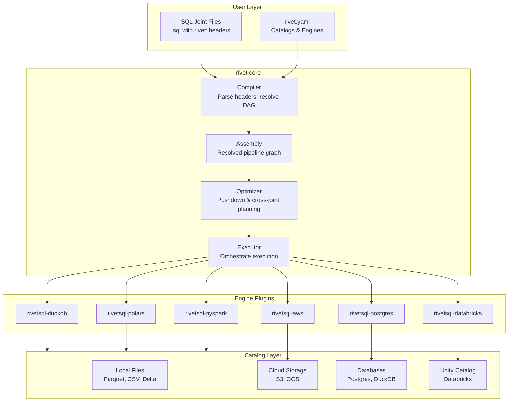
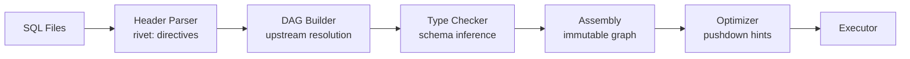
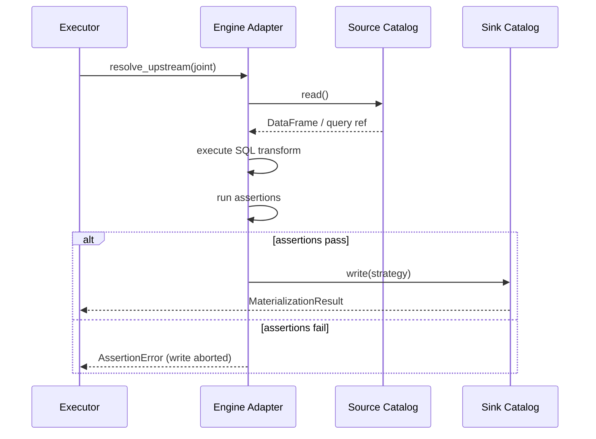
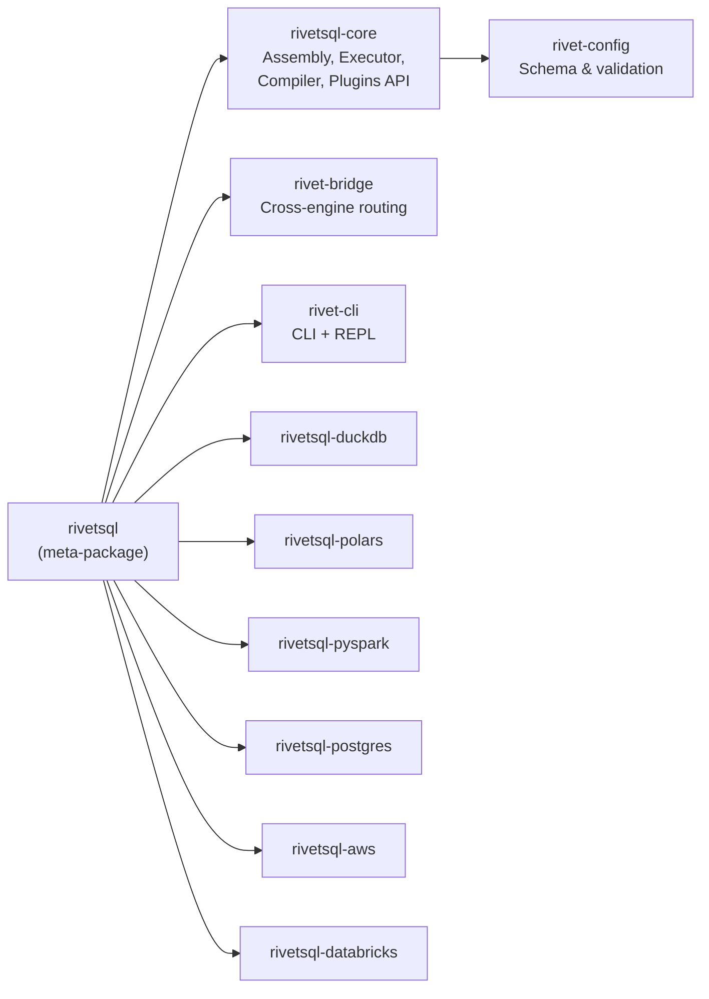

# Architecture

Rivet separates **what** to compute from **how** and **where**. This page explains how the core abstractions fit together.

## High-Level Overview

## Compilation Pipeline

## Execution Model

Each joint goes through three phases at runtime:

## Package Structure

## Key Abstractions

| Abstraction | Role | Defined In |
|---|---|---|
| `Joint` | A single SQL transform node in the DAG | `rivetsql-core` |
| `Assembly` | Immutable compiled pipeline graph | `rivetsql-core` |
| `ComputeEngine` | Named engine (e.g. `duckdb`, `spark`) | `rivetsql-core` |
| `Catalog` | Named data location (e.g. `warehouse`) | `rivetsql-core` |
| `ComputeEnginePlugin` | Plugin interface for engine adapters | `rivetsql-core` |
| `CatalogPlugin` | Plugin interface for catalog adapters | `rivetsql-core` |
| `Executor` | Walks the Assembly graph and drives execution | `rivetsql-core` |
| `CrossJointAdapter` | Handles data handoff between different engines | `rivet-bridge` |
