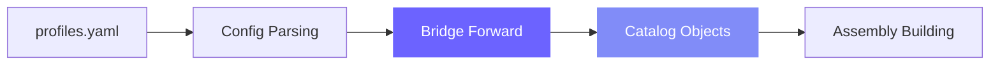

# Catalogs

A catalog declares *where* data lives. It is a named reference to a data location — a filesystem path, a database connection, an object store bucket — that joints use to read from and write to without knowing the underlying storage details.

---

## Catalog Invariants

- Names are globally unique — no two catalogs can share a name
- `type` is required — selects the plugin or built-in implementation
- Configuration is opaque to core — `rivet_core` does not validate catalog options; the plugin does
- Introspection is best-effort — listing tables and fetching schemas must never block compilation or execution

---

## Defining Catalogs

Catalogs are defined in `profiles.yaml` under the `catalogs` key:

=== "YAML"

    ```yaml
    # profiles.yaml
    default:
      catalogs:
        local:
          type: filesystem
          path: ./data
        warehouse:
          type: duckdb
          database: ./warehouse.duckdb
    ```

=== "Rivet API"

    ```python
    from rivet_core.models import Catalog

    local = Catalog(name="local", type="filesystem", options={"path": "./data"})
    warehouse = Catalog(
        name="warehouse",
        type="duckdb",
        options={"database": "./warehouse.duckdb"},
    )
    ```

---

## Catalog Types

| Type | Description | Plugin |
|------|-------------|--------|
| `filesystem` | Local or mounted filesystem (Parquet, CSV, JSON) | built-in |
| `duckdb` | DuckDB database file | `rivet-duckdb` |
| `postgres` | PostgreSQL database | `rivet-postgres` |
| `s3` | AWS S3 object store | `rivet-aws` |
| `glue` | AWS Glue Data Catalog | `rivet-aws` |
| `unity` | Unity Catalog (Databricks) | `rivet-databricks` |

---

## Using Catalogs in Joints

### In Sources

A source reads a table from a catalog:

=== "SQL"

    ```sql
    -- rivet:name: raw_events
    -- rivet:type: source
    -- rivet:catalog: warehouse
    -- rivet:table: events.raw
    ```

=== "YAML"

    ```yaml
    name: raw_events
    type: source
    catalog: warehouse
    table: events.raw
    ```

=== "Rivet API"

    ```python
    from rivet_core.models import Joint

    raw_events = Joint(
        name="raw_events",
        joint_type="source",
        catalog="warehouse",
        table="events.raw",
    )
    ```

### In Sinks

A sink writes data to a catalog. The `write_strategy` controls how:

=== "SQL"

    ```sql
    -- rivet:name: events_sink
    -- rivet:type: sink
    -- rivet:upstream: cleaned_events
    -- rivet:catalog: warehouse
    -- rivet:table: events.cleaned
    -- rivet:write_strategy: replace
    ```

=== "YAML"

    ```yaml
    name: events_sink
    type: sink
    upstream: cleaned_events
    catalog: warehouse
    table: events.cleaned
    write_strategy: replace
    ```

=== "Rivet API"

    ```python
    from rivet_core.models import Joint

    events_sink = Joint(
        name="events_sink",
        joint_type="sink",
        upstream=["cleaned_events"],
        catalog="warehouse",
        table="events.cleaned",
        write_strategy="replace",
    )
    ```

---

## Multiple Catalogs

A single pipeline can read from and write to multiple catalogs — the standard ETL pattern:

```yaml
# profiles.yaml
default:
  catalogs:
    s3_raw:
      type: s3
      bucket: my-data-lake
      prefix: raw/
    warehouse:
      type: duckdb
      database: ./warehouse.duckdb
```

=== "SQL"

    ```sql
    -- Source: read from S3
    -- rivet:name: raw_clicks
    -- rivet:type: source
    -- rivet:catalog: s3_raw
    -- rivet:table: clicks/2024/

    -- Sink: write to DuckDB
    -- rivet:name: clicks_sink
    -- rivet:type: sink
    -- rivet:upstream: cleaned_clicks
    -- rivet:catalog: warehouse
    -- rivet:table: analytics.clicks
    -- rivet:write_strategy: append
    ```

=== "Rivet API"

    ```python
    from rivet_core.models import Joint

    raw_clicks = Joint(
        name="raw_clicks",
        joint_type="source",
        catalog="s3_raw",
        table="clicks/2024/",
    )

    clicks_sink = Joint(
        name="clicks_sink",
        joint_type="sink",
        upstream=["cleaned_clicks"],
        catalog="warehouse",
        table="analytics.clicks",
        write_strategy="append",
    )
    ```

---

## Catalog Resolution

Catalogs are resolved during the Bridge Forward stage — after config parsing and before assembly building:



At compilation time, the compiler validates that every catalog name referenced by a joint exists. If a joint references an unknown catalog, compilation fails with a clear error before any data is touched.

---

## Catalog Introspection

Some catalog types support introspection: listing tables and fetching schemas. Rivet uses this to improve compilation fidelity and power the REPL's tab-completion.

!!! note
    Introspection is best-effort. If a catalog doesn't support it or the connection is unavailable, Rivet logs a warning and continues. Introspection failures never block compilation or execution.
