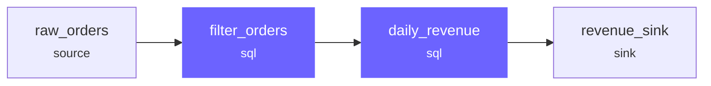

# Compilation

Compilation transforms a set of joint declarations into an immutable `CompiledAssembly` — the single source of truth that drives execution, CLI display, testing, and inspection.

!!! abstract "Compilation is pure"
    `compile()` performs no data reads, no data writes, and no runtime introspection. Given the same inputs, it always produces the same output.

---

## The Pipeline


| Stage | What happens |
|-------|-------------|
| Config Parsing | Read `rivet.yaml` and `profiles.yaml`, resolve profile, validate schemas |
| Bridge Forward | Instantiate catalog and engine objects, resolve plugin entry points |
| Assembly Building | Collect joints, resolve upstream references, build the DAG |
| Compilation | Validate DAG, assign execution order, fuse adjacent joints, produce `CompiledAssembly` |
| Execution | Follow `execution_order` exactly — no re-resolution at runtime |

---

## Stage 1: Config Parsing

Rivet reads two configuration files:

- `rivet.yaml` — project manifest: directory paths for sources, joints, sinks, tests, and profiles
- `profiles.yaml` — environment-specific: catalogs, engines, default engine, credentials

The active profile is selected by `--profile` flag or `RIVET_PROFILE` environment variable.

---

## Stage 2: Bridge Forward

`rivet_bridge` converts raw config into live objects:

- Catalog configs become `Catalog` model instances
- Engine configs become `ComputeEngine` instances with resolved plugin types
- Plugin entry points are resolved via the plugin registry

This is the only stage where plugin code is loaded. After bridge forward, the rest of the pipeline works with pure data models.

---

## Stage 3: Assembly Building

The `Assembly` validates structural integrity of the joint DAG:

- Joint names must be globally unique
- All upstream references must resolve to existing joints
- Source joints must have no upstream
- Sink joints must have at least one upstream
- The graph must be acyclic

Violations raise an `AssemblyError` with a structured `RivetError` containing the error code, message, and remediation hint.

=== "SQL"

    ```sql
    -- rivet:name: raw_orders
    -- rivet:type: source
    -- rivet:catalog: local
    -- rivet:table: orders

    -- rivet:name: daily_revenue
    -- rivet:type: sql
    -- rivet:upstream: raw_orders
    SELECT order_date, SUM(amount) AS revenue
    FROM raw_orders
    GROUP BY order_date

    -- rivet:name: revenue_sink
    -- rivet:type: sink
    -- rivet:upstream: daily_revenue
    -- rivet:catalog: warehouse
    -- rivet:table: daily_revenue
    -- rivet:write_strategy: replace
    ```

=== "YAML"

    ```yaml
    # sources/raw_orders.yaml
    name: raw_orders
    type: source
    catalog: local
    table: orders

    # joints/daily_revenue.yaml
    name: daily_revenue
    type: sql
    upstream: [raw_orders]
    sql: |
      SELECT order_date, SUM(amount) AS revenue
      FROM raw_orders
      GROUP BY order_date

    # sinks/revenue_sink.yaml
    name: revenue_sink
    type: sink
    upstream: daily_revenue
    catalog: warehouse
    table: daily_revenue
    write_strategy: replace
    ```

=== "Rivet API"

    ```python
    from rivet_core.models import Joint

    raw_orders = Joint(
        name="raw_orders",
        joint_type="source",
        catalog="local",
        table="orders",
    )

    daily_revenue = Joint(
        name="daily_revenue",
        joint_type="sql",
        upstream=["raw_orders"],
        sql="SELECT order_date, SUM(amount) AS revenue FROM raw_orders GROUP BY order_date",
    )

    revenue_sink = Joint(
        name="revenue_sink",
        joint_type="sink",
        upstream=["daily_revenue"],
        catalog="warehouse",
        table="daily_revenue",
        write_strategy="replace",
    )
    ```

---

## Stage 4: Compilation

`compile()` takes an `Assembly` and produces a `CompiledAssembly`.

### Engine Resolution

Each joint is assigned an engine. Resolution order:

1. Joint-level `engine` override (highest priority)
2. Profile-level `default_engine`

### SQL Fusion

Adjacent SQL joints on the same engine instance are fused into a single query using CTEs:



Fusion is broken by:

- A Python joint between two SQL joints
- An engine instance change
- An explicit `eager: true` flag

### Execution Order

`compile()` produces a topologically sorted `execution_order` list. The executor follows this list exactly — it never re-resolves or re-orders at runtime.

### Introspection (Best-Effort)

During compilation, Rivet optionally introspects source schemas from catalogs. This improves SQL validation and column lineage tracking, but introspection failures never block compilation.

---

## The CompiledAssembly

`CompiledAssembly` is an immutable frozen dataclass:

| Field | Description |
|-------|-------------|
| `success` | Whether compilation succeeded |
| `joints` | `CompiledJoint` objects with resolved engine, adapter, SQL, and schema |
| `fused_groups` | Groups of SQL joints fused into single queries |
| `execution_order` | Topologically sorted list of group IDs and standalone joint names |
| `materializations` | Where intermediate results are materialized and why |
| `engine_boundaries` | Engine type changes between adjacent groups |
| `errors` | Structured `RivetError` list (non-empty when `success=False`) |
| `warnings` | Non-fatal issues (missing schemas, skipped introspection) |

### Compilation Errors

If compilation fails, `success` is `False` and the executor refuses to run. Common errors:

| Code | Cause |
|------|-------|
| `RVT-301` | Duplicate joint name |
| `RVT-302` | Unknown upstream reference |
| `RVT-303` | Source joint has upstream |
| `RVT-304` | Sink joint has no upstream |
| `RVT-305` | Cyclic dependency in DAG |
