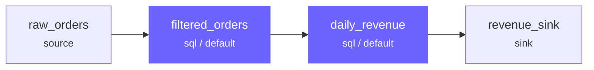

# ComputeEngines

A ComputeEngine decides *how* to execute the SQL or Python logic declared by joints. Engines are named, globally unique, and deterministic — they never perform introspection and never re-resolve their configuration at runtime.

---

## Configuration

Engines are declared in `profiles.yaml`:

```yaml
default:
  engines:
    - name: default
      type: duckdb
      catalogs: [local, warehouse]
    - name: spark
      type: pyspark
      catalogs: [local, warehouse]
  default_engine: default
```

| Field | Required | Description |
|-------|----------|-------------|
| `name` | yes | Globally unique engine identifier |
| `type` | yes | Plugin type (`duckdb`, `polars`, `pyspark`, `databricks`) |
| `catalogs` | yes | Catalog names this engine can access |
| `default_engine` | profile-level | Engine to use when a joint doesn't specify one |

Additional fields (e.g. `warehouse_id` for Databricks) are engine-type-specific and validated by the plugin.

### Managing Engines via CLI

List engines in the current profile:

```bash
rivet engine list
rivet engine list --format json
rivet engine list my_duckdb
```

Create a new engine interactively or non-interactively:

```bash
# Interactive wizard — prompts for type, name, catalogs, and options
rivet engine create

# Non-interactive
rivet engine create --type duckdb --name analytics --catalog warehouse --set-default
```

See the [CLI reference](../reference/cli/rivet_engine.md) for full details.

---

## Assigning Engines to Joints

By default, joints use the `default_engine` from the active profile. Override per joint:

=== "SQL"

    ```sql
    -- rivet:name: heavy_transform
    -- rivet:type: sql
    -- rivet:engine: spark
    -- rivet:upstream: raw_events

    SELECT user_id, COUNT(*) AS event_count
    FROM raw_events
    GROUP BY user_id
    ```

=== "YAML"

    ```yaml
    name: heavy_transform
    type: sql
    engine: spark
    upstream: [raw_events]
    sql: |
      SELECT user_id, COUNT(*) AS event_count
      FROM raw_events
      GROUP BY user_id
    ```

=== "Rivet API"

    ```python
    from rivet_core.models import Joint

    heavy_transform = Joint(
        name="heavy_transform",
        joint_type="sql",
        engine="spark",
        upstream=["raw_events"],
        sql="""
        SELECT user_id, COUNT(*) AS event_count
        FROM raw_events
        GROUP BY user_id
        """,
    )
    ```

---

## SQL Fusion

Adjacent joints assigned to the same engine instance are fused by default — they execute as a single query rather than materializing intermediate results. Fusion reduces memory pressure and avoids unnecessary data movement.



In this example, `filtered_orders` and `daily_revenue` are both on the `default` engine. The compiler fuses them into a single SQL query — `filtered_orders` is never materialized as a standalone table.

### Fusion Boundaries

Fusion stops at:

- **Engine boundaries** — a joint on `spark` cannot fuse with a joint on `default`
- **Python joints** — always break fusion; adjacent SQL joints compile into separate groups
- **Eager joints** — `eager: true` forces materialization and breaks the chain
- **Sink joints** — always leaf nodes, terminate a fusion group

---

## Cross-Engine Data Transfer

When a joint on one engine reads from a joint on a different engine, Rivet uses a `CrossJointAdapter` to transfer data across the boundary:

| Strategy | When used |
|----------|-----------|
| `arrow_passthrough` | Default — data is materialized as PyArrow Table and passed to the consumer |
| `native_reference` | Both engines share a catalog — consumer reads directly without copying |

The strategy is resolved at compile time and recorded in the `CompiledAssembly`. The executor never re-resolves it at runtime.

---

## Engine Invariants

!!! abstract "Key guarantees"
    - Names are globally unique within a profile
    - Behavior is deterministic — same assembly always produces the same plan
    - Engines do not introspect — never read catalog metadata at compile time
    - Configuration is validated at bridge time, before compilation begins

---

## Available Engine Types

| Type | Plugin | Best for |
|------|--------|----------|
| `arrow` | built-in | Lightweight in-memory SQL via DuckDB |
| `duckdb` | `rivet-duckdb` | Local analytics, fast SQL on files |
| `polars` | `rivet-polars` | In-process DataFrame transforms |
| `pyspark` | `rivet-pyspark` | Large-scale distributed processing |
| `postgres` | `rivet-postgres` | Server-side SQL on PostgreSQL |
| `databricks` | `rivet-databricks` | Databricks SQL warehouses |

See [Plugins](../plugins/index.md) for configuration details per engine type.
