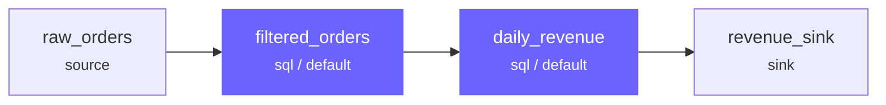
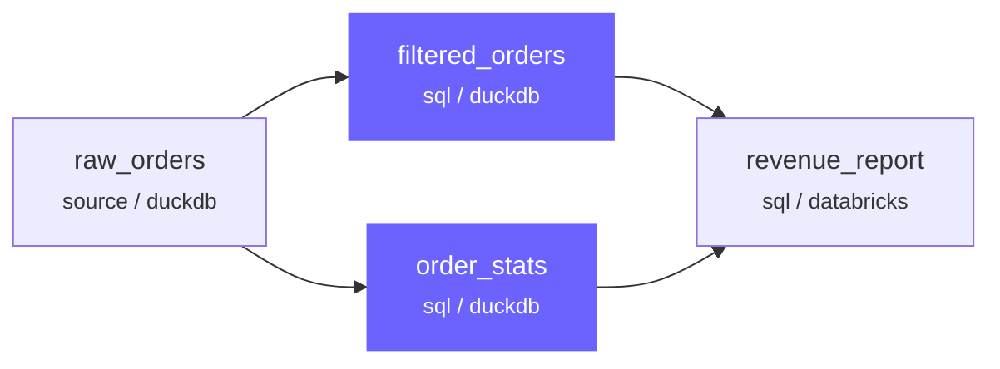

# ComputeEngines

A ComputeEngine decides *how* to execute the SQL or Python logic declared by joints. Engines are named, globally unique, and deterministic — they never perform introspection and never re-resolve their configuration at runtime.

---

## Configuration

Engines are declared in `profiles.yaml`:

```yaml
default:
  engines:
    - name: default
      type: duckdb
      catalogs: [local, warehouse]
    - name: spark
      type: pyspark
      catalogs: [local, warehouse]
  default_engine: default
```

| Field | Required | Description |
|-------|----------|-------------|
| `name` | yes | Globally unique engine identifier |
| `type` | yes | Plugin type (`duckdb`, `polars`, `pyspark`, `databricks`) |
| `catalogs` | yes | Catalog names this engine can access |
| `concurrency_limit` | no | Max fused groups executing in parallel on this engine (default: `1`) |
| `default_engine` | profile-level | Engine to use when a joint doesn't specify one |

Additional fields (e.g. `warehouse_id` for Databricks, `concurrency_limit` for parallel execution) are engine-type-specific and validated by the plugin.

### Managing Engines via CLI

List engines in the current profile:

```bash
rivet engine list
rivet engine list --format json
rivet engine list my_duckdb
```

Create a new engine interactively or non-interactively:

```bash
# Interactive wizard — prompts for type, name, catalogs, and options
rivet engine create

# Non-interactive
rivet engine create --type duckdb --name analytics --catalog warehouse --set-default
```

See the [CLI reference](../reference/cli/rivet_engine.md) for full details.

---

## Assigning Engines to Joints

By default, joints use the `default_engine` from the active profile. Override per joint:

=== "SQL"

    ```sql
    -- rivet:name: heavy_transform
    -- rivet:type: sql
    -- rivet:engine: spark
    -- rivet:upstream: raw_events

    SELECT user_id, COUNT(*) AS event_count
    FROM raw_events
    GROUP BY user_id
    ```

=== "YAML"

    ```yaml
    name: heavy_transform
    type: sql
    engine: spark
    upstream: [raw_events]
    sql: |
      SELECT user_id, COUNT(*) AS event_count
      FROM raw_events
      GROUP BY user_id
    ```

=== "Rivet API"

    ```python
    from rivet_core.models import Joint

    heavy_transform = Joint(
        name="heavy_transform",
        joint_type="sql",
        engine="spark",
        upstream=["raw_events"],
        sql="""
        SELECT user_id, COUNT(*) AS event_count
        FROM raw_events
        GROUP BY user_id
        """,
    )
    ```

---

## SQL Fusion

Adjacent joints assigned to the same engine instance are fused by default — they execute as a single query rather than materializing intermediate results. Fusion reduces memory pressure and avoids unnecessary data movement.



In this example, `filtered_orders` and `daily_revenue` are both on the `default` engine. The compiler fuses them into a single SQL query — `filtered_orders` is never materialized as a standalone table.

### Fusion Boundaries

Fusion stops at:

- **Engine boundaries** — a joint on `spark` cannot fuse with a joint on `default`
- **Python joints** — always break fusion; adjacent SQL joints compile into separate groups
- **Eager joints** — `eager: true` forces materialization and breaks the chain
- **Sink joints** — always leaf nodes, terminate a fusion group

---

## Parallel Execution & Concurrency

When a pipeline DAG contains independent branches (fused groups with no data dependency between them), Rivet executes them in parallel. The executor builds a dependency graph from the compiled assembly, identifies groups whose upstream dependencies are satisfied, and submits them concurrently — constrained by per-engine concurrency pools.

### How It Works

The executor uses a wavefront scheduler:

1. Groups with no upstream dependencies are "ready" and start immediately.
2. As each group completes, downstream groups whose dependencies are now fully satisfied become ready.
3. Ready groups are submitted concurrently, up to each engine's concurrency limit.



In this example, `filtered_orders` and `order_stats` are independent — they both read from `raw_orders` but don't depend on each other. The executor runs them in parallel (wave 1: `raw_orders`, wave 2: `filtered_orders` + `order_stats`, wave 3: `revenue_report`).

### Execution Waves

The compiler produces a parallel execution plan that organizes fused groups into ordered waves. Each wave contains groups that can execute concurrently:

```
Execution Plan:
  Wave 1: [load_sources (engine: duckdb)]
  Wave 2: [transform_a (engine: duckdb), transform_b (engine: databricks)]  ← parallel
  Wave 3: [final_join (engine: databricks)]
```

This plan is visible in the CLI `run` output and the interactive session's `inspect` command.

### Engine Concurrency Limits

Each engine has a concurrency limit that caps how many fused groups can execute simultaneously on that engine. This prevents overwhelming remote backends like Databricks SQL warehouses.

```yaml
engines:
  - name: databricks
    type: databricks
    catalogs: [unity]
    warehouse_id: abc123
    workspace_url: https://my-workspace.cloud.databricks.com
    token: ${DATABRICKS_TOKEN}
    concurrency_limit: 4
```

The concurrency limit is resolved with this priority:

1. `concurrency_limit` in the engine config (user override)
2. The engine plugin's `default_concurrency_limit` (plugin-specific default)
3. Fallback: `1` (sequential execution)

!!! info "Default is sequential"
    Without an explicit `concurrency_limit`, each engine defaults to `1` — meaning fused groups on that engine run one at a time. Set `concurrency_limit` to enable parallelism.

### Cross-Engine Parallelism

Each engine maintains its own independent concurrency pool. Groups on different engines run in parallel without affecting each other's pool:

| Engine | concurrency_limit | Behavior |
|--------|:-----------------:|----------|
| `duckdb` | `1` | Groups run sequentially (in-process, single-writer) |
| `databricks` | `4` | Up to 4 groups run concurrently on the SQL warehouse |
| `pyspark` | `2` | Up to 2 groups run concurrently on the Spark cluster |

If two unlinked groups target different engines, they always run in parallel — each engine's pool is independent.

### Choosing a Concurrency Limit

The right value depends on your backend:

| Engine type | Guidance |
|-------------|----------|
| `duckdb` | Keep at `1`. DuckDB is in-process and single-writer. |
| `polars` | Keep at `1`. In-process, CPU-bound. |
| `databricks` | Match your warehouse capacity. Small serverless: `4`–`8`. Large dedicated: `8`–`16`. |
| `pyspark` | Depends on cluster resources. Start with `2`–`4`. |
| `postgres` | Match your connection pool size. Typically `2`–`8`. |

!!! warning "Validation"
    `concurrency_limit` must be a positive integer (≥ 1). Values like `0`, `-1`, or non-integers cause a validation error (`RVT-501`) before execution begins.

### Fail-Fast Behavior

Parallel execution respects the `fail_fast` setting:

- `fail_fast=True` (default): When a group fails, all pending groups are cancelled. Currently running groups are allowed to finish.
- `fail_fast=False`: When a group fails, only its downstream dependents are skipped. Independent branches continue executing.

---

## Cross-Engine Data Transfer

When a joint on one engine reads from a joint on a different engine, Rivet uses a `CrossJointAdapter` to transfer data across the boundary:

| Strategy | When used |
|----------|-----------|
| `arrow_passthrough` | Default — data is materialized as PyArrow Table and passed to the consumer |
| `native_reference` | Both engines share a catalog — consumer reads directly without copying |

The strategy is resolved at compile time and recorded in the `CompiledAssembly`. The executor never re-resolves it at runtime.

---

## Engine Invariants

!!! abstract "Key guarantees"
    - Names are globally unique within a profile
    - Behavior is deterministic — same assembly always produces the same plan
    - Engines do not introspect — never read catalog metadata at compile time
    - Configuration is validated at bridge time, before compilation begins

---

## Available Engine Types

| Type | Plugin | Best for |
|------|--------|----------|
| `arrow` | built-in | Lightweight in-memory SQL via DuckDB |
| `duckdb` | `rivet-duckdb` | Local analytics, fast SQL on files |
| `polars` | `rivet-polars` | In-process DataFrame transforms |
| `pyspark` | `rivet-pyspark` | Large-scale distributed processing |
| `postgres` | `rivet-postgres` | Server-side SQL on PostgreSQL |
| `databricks` | `rivet-databricks` | Databricks SQL warehouses |

See [Plugins](../plugins/index.md) for configuration details per engine type.
