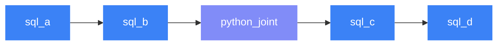

# Python Joints

Python joints let you run arbitrary Python code inside a Rivet pipeline. Use them when SQL isn't enough — ML inference, API calls, complex row-level logic, or anything that needs a real programming language.

---

## How It Works

A Python joint receives upstream data as `Material` objects, runs your function, and returns the result. Rivet handles serialization, materialization, and DAG ordering automatically.


---

## Declaration

Python joints can be declared in three ways:

=== "Python"

    Place a `.py` file in `joints/` with `# rivet:` annotations. The `type` defaults to `python` and the `function` is auto-derived from the file path.

    ```python
    # joints/enrich_orders.py
    # rivet:upstream: [raw_orders]
    import pyarrow as pa
    from rivet_core.models import Material

    def transform(material: Material) -> pa.Table:
        table = material.to_arrow()
        return table.append_column("enriched", pa.array([True] * len(table)))
    ```

    Auto-derived values: `name=enrich_orders`, `type=python`, `function=joints.enrich_orders:transform`.

=== "SQL"

    Declare the joint in a `.sql` file with annotations pointing to an external function:

    ```sql
    -- rivet:name: enrich_orders
    -- rivet:type: python
    -- rivet:upstream: raw_orders
    -- rivet:function: joints.enrich_orders:transform
    ```

    ```python
    # joints/enrich_orders.py
    import pyarrow as pa
    from rivet_core.models import Material

    def transform(material: Material) -> pa.Table:
        table = material.to_arrow()
        return table.append_column("enriched", pa.array([True] * len(table)))
    ```

=== "YAML"

    ```yaml
    name: enrich_orders
    type: python
    upstream: [raw_orders]
    function: joints.enrich_orders:transform
    ```

    ```python
    # joints/enrich_orders.py
    import pyarrow as pa
    from rivet_core.models import Material

    def transform(material: Material) -> pa.Table:
        table = material.to_arrow()
        return table.append_column("enriched", pa.array([True] * len(table)))
    ```

=== "Rivet API"

    ```python
    from rivet_core.models import Joint

    enrich_orders = Joint(
        name="enrich_orders",
        joint_type="python",
        upstream=["raw_orders"],
        function="joints.enrich_orders:transform",
    )
    ```

    ```python
    # joints/enrich_orders.py
    import pyarrow as pa
    from rivet_core.models import Material

    def transform(material: Material) -> pa.Table:
        table = material.to_arrow()
        return table.append_column("enriched", pa.array([True] * len(table)))
    ```

---

## Function Signatures

### Single upstream

When a joint has exactly one upstream dependency, Rivet passes the `Material` directly:

```python
import pyarrow as pa
from rivet_core.models import Material

def transform(material: Material) -> pa.Table:
    table = material.to_arrow()
    # ... your logic ...
    return table
```

### Multiple upstreams

When a joint has multiple upstream dependencies, Rivet passes a `dict[str, Material]` keyed by joint name:

```python
import pyarrow as pa
from rivet_core.models import Material

def transform(inputs: dict[str, Material]) -> pa.Table:
    orders = inputs["raw_orders"].to_arrow()
    customers = inputs["raw_customers"].to_arrow()
    # ... join, merge, etc. ...
    return result_table
```

### With RivetContext

Add a `context` parameter with a `RivetContext` type annotation to receive execution metadata:

```python
import pyarrow as pa
from rivet_core.context import RivetContext
from rivet_core.models import Material

def transform(material: Material, context: RivetContext | None = None) -> pa.Table:
    context.logger.info(f"Running {context.joint_name}")
    table = material.to_arrow()
    return table
```

`RivetContext` provides:

| Attribute | Type | Description |
|-----------|------|-------------|
| `joint_name` | `str` | Name of the current joint |
| `options` | `dict` | Joint-level options |
| `logger` | `RivetLogger` | Scoped logger for structured output |
| `run_metadata` | `dict` | Run-level metadata (run_id, profile, timestamps) |

### Async functions

Async functions are supported. Rivet calls them with `asyncio.run()`:

```python
import pyarrow as pa
from rivet_core.models import Material

async def transform(material: Material) -> pa.Table:
    table = material.to_arrow()
    # await some_async_api(...)
    return table
```

---

## Return Types

Python joints accept multiple return types. Rivet normalizes everything internally.

### PyArrow Table

The most direct return type — zero conversion overhead:

```python
import pyarrow as pa
from rivet_core.models import Material

def transform(material: Material) -> pa.Table:
    table = material.to_arrow()
    return table.filter(pa.compute.greater(table["amount"], 0))
```

### Pandas DataFrame

Automatically converted to Arrow via `pyarrow.Table.from_pandas()`:

```python
import pandas as pd
from rivet_core.models import Material

def transform(material: Material) -> pd.DataFrame:
    df = material.to_arrow().to_pandas()
    df["amount_usd"] = df["amount"] * df["exchange_rate"]
    return df
```

### Polars DataFrame

Converted to Arrow via `polars.DataFrame.to_arrow()`:

```python
import polars as pl
from rivet_core.models import Material

def transform(material: Material) -> pl.DataFrame:
    df = material.to_polars()
    return df.with_columns(
        (pl.col("amount") * pl.col("exchange_rate")).alias("amount_usd")
    )
```

!!! tip "Zero-copy input"
    Use `material.to_polars()` instead of converting from Arrow manually. It uses zero-copy conversion when possible.

### PySpark DataFrame

Converted to Arrow via `toPandas()` → `from_pandas()`:

```python
from pyspark.sql import functions as F
from rivet_core.models import Material

def transform(material: Material):
    df = material.to_spark()
    return df.withColumn("amount_usd", F.col("amount") * F.col("exchange_rate"))
```

!!! warning "Performance"
    PySpark → Arrow conversion collects data to the driver. Use this for small-to-medium results. For large datasets, consider keeping the pipeline in SQL joints on the PySpark engine.

### Material

Return a `Material` directly when you need full control over metadata. The `Material` must have a valid `materialized_ref`:

```python
from rivet_core.models import Material

def transform(material: Material) -> Material:
    # Pass through with no changes
    return material
```

This is useful for conditional passthrough, caching, or wrapping results from external systems that already produce `Material` objects.

### MaterializedRef

Return a raw `MaterializedRef` — Rivet wraps it in a `Material` automatically:

```python
from rivet_core.models import Material
from rivet_core.strategies import MaterializedRef

def transform(material: Material) -> MaterializedRef:
    return material.materialized_ref
```

### Summary

| Return type | Conversion | Best for |
|-------------|-----------|----------|
| `pyarrow.Table` | None | Default, lowest overhead |
| `pandas.DataFrame` | `from_pandas()` | Pandas-native logic |
| `polars.DataFrame` | `.to_arrow()` | Polars-native logic |
| `pyspark.DataFrame` | `toPandas()` → Arrow | Spark-native logic (small results) |
| `Material` | None | Passthrough, metadata control |
| `MaterializedRef` | Wrapped in `Material` | Low-level control |

---

## Reading Input Data

`Material` provides conversion methods for every supported framework:

```python
table = material.to_arrow()      # → pyarrow.Table
df    = material.to_pandas()     # → pandas.DataFrame
df    = material.to_polars()     # → polars.DataFrame
rel   = material.to_duckdb()     # → duckdb.DuckDBPyRelation
df    = material.to_spark()      # → pyspark.sql.DataFrame
```

You can also inspect the data without converting:

```python
material.columns    # → list[str]
material.num_rows   # → int
```

!!! note "Install dependencies"
    `to_polars()`, `to_pandas()`, `to_duckdb()`, and `to_spark()` require their respective packages to be installed. They raise `ImportError` with install instructions if missing.

---

## Function Path Format

The `function` field uses a dotted module path with a colon separator for the callable:

```
module.path:function_name
```

| File path | Derived function |
|-----------|-----------------|
| `joints/scoring.py` | `joints.scoring:transform` |
| `joints/ml/predict.py` | `joints.ml.predict:transform` |
| `lib/utils.py` (explicit) | `lib.utils:my_custom_fn` |

When using `.py` declaration files, the function is auto-derived as `<module_path>:transform` if not specified. You can override it:

```python
# joints/scoring.py
# rivet:function: lib.ml:score_batch
```

---

## Annotation Reference

All annotations for Python joint `.py` files:

| Annotation | Default | Description |
|------------|---------|-------------|
| `name` | File stem | Joint name |
| `type` | `python` | Joint type |
| `function` | Auto-derived | Dotted path to callable |
| `upstream` | — | List of upstream joint names |
| `engine` | Project default | Engine override |
| `eager` | `false` | Force materialization before downstream |
| `tags` | `[]` | Metadata tags |
| `description` | — | Human-readable description |

---

## Fusion Boundaries

Python joints always break SQL fusion. Adjacent SQL joints on either side compile into separate fused groups:



In this example, `sql_a + sql_b` fuse into one group, `sql_c + sql_d` fuse into another, and `python_joint` runs standalone between them.

!!! tip "Minimize boundaries"
    Keep Python joints at the edges of your pipeline when possible. Every Python joint forces a materialization round-trip between fused SQL groups.

---

## Error Handling

| Code | Cause | Remediation |
|------|-------|-------------|
| `RVT-751` | Function import failed or raised an exception | Check the function path and fix the error |
| `RVT-752` | Function returned `None` or unsupported type | Return one of the supported types |
| `RVT-753` | Function path is not importable at compile time | Verify the dotted path resolves to a callable |

---

## Examples

### ML scoring with scikit-learn

```python
# joints/score_orders.py
# rivet:upstream: [enriched_orders]
import pyarrow as pa
import pickle
from rivet_core.models import Material

def transform(material: Material) -> pa.Table:
    table = material.to_arrow()
    df = table.to_pandas()

    with open("models/order_scorer.pkl", "rb") as f:
        model = pickle.load(f)

    df["score"] = model.predict_proba(df[["amount", "frequency"]])[:, 1]
    return pa.Table.from_pandas(df)
```

### Polars window functions

```python
# joints/rolling_avg.py
# rivet:upstream: [daily_metrics]
import polars as pl
from rivet_core.models import Material

def transform(material: Material) -> pl.DataFrame:
    df = material.to_polars()
    return df.with_columns(
        pl.col("revenue")
          .rolling_mean(window_size=7)
          .over("region")
          .alias("revenue_7d_avg")
    )
```

### External API enrichment

```python
# joints/geocode_addresses.py
# rivet:upstream: [raw_addresses]
import pyarrow as pa
import httpx
from rivet_core.context import RivetContext
from rivet_core.models import Material

def transform(material: Material, context: RivetContext | None = None) -> pa.Table:
    table = material.to_arrow()
    addresses = table.column("address").to_pylist()

    coords = []
    for addr in addresses:
        resp = httpx.get("https://api.example.com/geocode", params={"q": addr})
        data = resp.json()
        coords.append({"lat": data["lat"], "lon": data["lon"]})

    context.logger.info(f"Geocoded {len(coords)} addresses")
    return table.append_column("lat", pa.array([c["lat"] for c in coords])) \
                .append_column("lon", pa.array([c["lon"] for c in coords]))
```

### Conditional passthrough

```python
# joints/maybe_transform.py
# rivet:upstream: [raw_data]
from rivet_core.models import Material

def transform(material: Material) -> Material:
    if material.num_rows == 0:
        return material  # passthrough empty data
    table = material.to_arrow()
    # ... transform non-empty data ...
    return table
```
