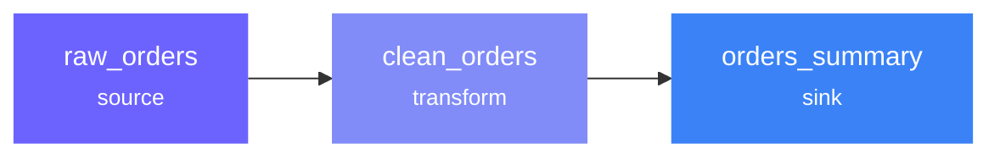

---
hide:
  - navigation
  - toc
---

<div class="hero" markdown>


# Rivet

<p class="subtitle">
Declarative SQL pipelines with multi-engine execution, quality checks, and built-in testing. Define once — run anywhere.
</p>

<div class="hero-buttons" markdown>

[Get Started](getting-started.md){ .md-button .md-button--primary }
[View on GitHub](https://github.com/rivetsql/rivetsql){ .md-button }

</div>

</div>

<div class="install-banner" markdown>

```
pip install rivetsql
```

</div>

---

## What is Rivet?

Rivet separates **what** to compute from **how** to compute it and **where** data lives. Write your pipeline logic once as declarative joints, then run it on DuckDB, Polars, PySpark, or Postgres — without changing a single line.



<div class="feature-grid" markdown>

<div class="feature-card" markdown>
<span class="feature-icon">:material-swap-horizontal:</span>

### Multi-Engine

Swap between DuckDB, Polars, PySpark, and Postgres without rewriting pipelines. Adjacent SQL joints on the same engine are automatically fused into a single query.
</div>

<div class="feature-card" markdown>
<span class="feature-icon">:material-file-document-edit-outline:</span>

### Declarative Pipelines

Define joints in SQL, YAML, or Python. Rivet compiles them into an immutable execution plan — no imperative orchestration code needed.
</div>

<div class="feature-card" markdown>
<span class="feature-icon">:material-shield-check-outline:</span>

### Quality Checks

Assertions validate data before writes. Audits verify data after writes. Catch bad data before it reaches your warehouse.
</div>

<div class="feature-card" markdown>
<span class="feature-icon">:material-test-tube:</span>

### Built-in Testing

Offline fixture-based tests validate joint logic without any database. Fast, deterministic, and CI-friendly.
</div>

<div class="feature-card" markdown>
<span class="feature-icon">:material-puzzle-outline:</span>

### Plugin System

Extend Rivet with engines, catalogs, and adapters. First-party plugins for DuckDB, Polars, PySpark, Postgres, AWS, and Databricks.
</div>

<div class="feature-card" markdown>
<span class="feature-icon">:material-console:</span>

### Interactive REPL

Full-screen terminal UI for exploring data, running ad-hoc queries, browsing catalogs, and debugging pipelines.
</div>

</div>

---

## The Three Pillars

<div class="pillar-grid" markdown>

<div class="pillar-card" markdown>
<div class="pillar-icon" markdown>:material-cog-outline:</div>

### Joints

<div class="pillar-subtitle" markdown>What to compute</div>

Named, declarative units of computation. Sources read data, SQL and Python joints transform it, sinks write it out.

</div>

<div class="pillar-card" markdown>
<div class="pillar-icon" markdown>:material-engine-outline:</div>

### Engines

<div class="pillar-subtitle" markdown>How to compute</div>

Pluggable compute backends. DuckDB for local speed, PySpark for scale, Polars for DataFrames, Postgres for databases.

</div>

<div class="pillar-card" markdown>
<div class="pillar-icon" markdown>:material-database-outline:</div>

### Catalogs

<div class="pillar-subtitle" markdown>Where data lives</div>

Named references to data locations — filesystems, databases, S3 buckets, Glue, Unity Catalog. Storage-agnostic.

</div>

</div>

---

## Quick Example

=== "SQL"

    ```sql
    -- sources/raw_orders.sql
    -- rivet:name: raw_orders
    -- rivet:type: source
    -- rivet:catalog: local
    -- rivet:table: raw_orders.csv

    -- joints/clean_orders.sql
    -- rivet:name: clean_orders
    -- rivet:type: sql
    SELECT id, customer_name, amount, created_at
    FROM raw_orders
    WHERE amount > 0

    -- sinks/orders_clean.sql
    -- rivet:name: orders_clean
    -- rivet:type: sink
    -- rivet:catalog: local
    -- rivet:table: orders_clean
    -- rivet:upstream: [clean_orders]
    ```

=== "YAML"

    ```yaml
    # sources/raw_orders.yaml
    name: raw_orders
    type: source
    catalog: local
    table: raw_orders.csv

    # joints/clean_orders.yaml
    name: clean_orders
    type: sql
    upstream: [raw_orders]
    sql: |
      SELECT id, customer_name, amount, created_at
      FROM raw_orders
      WHERE amount > 0

    # sinks/orders_clean.yaml
    name: orders_clean
    type: sink
    catalog: local
    table: orders_clean
    upstream: [clean_orders]
    ```

=== "Python"

    ```python
    # joints/clean_orders.py
    # rivet:name: clean_orders
    # rivet:type: python
    # rivet:upstream: [raw_orders]
    import polars as pl
    from rivet_core.models import Material

    def transform(material: Material) -> pl.DataFrame:
        df = material.to_polars()
        return df.filter(pl.col("amount") > 0).select(
            "id", "customer_name", "amount", "created_at"
        )
    ```

=== "Rivet API"

    ```python
    from rivet_core.models import Joint

    raw_orders = Joint(
        name="raw_orders",
        joint_type="source",
        catalog="local",
        table="raw_orders.csv",
    )

    clean_orders = Joint(
        name="clean_orders",
        joint_type="sql",
        upstream=["raw_orders"],
        sql="SELECT id, customer_name, amount, created_at FROM raw_orders WHERE amount > 0",
    )

    orders_clean = Joint(
        name="orders_clean",
        joint_type="sink",
        catalog="local",
        table="orders_clean",
        upstream=["clean_orders"],
    )
    ```

```bash
$ rivet run
✓ compiled 3 joints in 45ms
  raw_orders       ✓ OK (5 rows)
  clean_orders     ✓ OK (4 rows)
  orders_clean     ✓ OK (4 rows)

  45ms | 3 joints | 1 groups | 0 failures
```

---

## Explore

<div class="link-grid" markdown>

<a class="link-card" href="getting-started/">
<strong>:material-rocket-launch: Getting Started</strong>
<span>Install, init, and run your first pipeline in 5 minutes</span>
</a>

<a class="link-card" href="concepts/">
<strong>:material-book-open-variant: Concepts</strong>
<span>Joints, engines, catalogs, compilation, and materialization</span>
</a>

<a class="link-card" href="guides/testing/">
<strong>:material-test-tube: Testing Guide</strong>
<span>Offline fixture-based testing with rivet test</span>
</a>

<a class="link-card" href="plugins/">
<strong>:material-puzzle-outline: Plugins</strong>
<span>DuckDB, Polars, PySpark, Postgres, AWS, Databricks</span>
</a>

</div>
